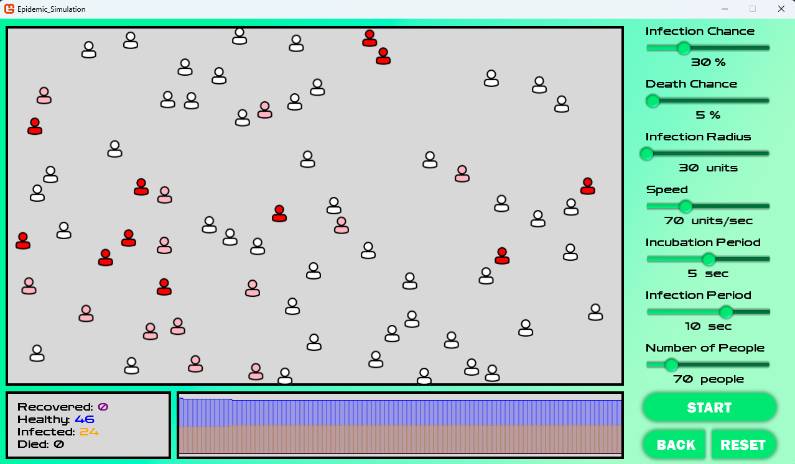

# Epidemic Simulation

Имитационная модель распространения эпидемии в замкнутой популяции.
Агентный подход: каждый человек — самостоятельный объект со своим
состоянием и перемещением, эпидемия возникает как результат их
взаимодействий.

## Возможности

- Настройка параметров модели через семь слайдеров: вероятность
  заражения, вероятность смерти, радиус заражения, скорость
  перемещения, инкубационный период, длительность болезни,
  численность популяции
- Пять состояний агента: здоровый, носитель (инкубационный период),
  заражённый, выздоровевший, умерший
- Упругие столкновения агентов друг с другом и с границами области
- Визуализация состояний агентов в реальном времени и подсветка
  радиуса заражения при наведении на соответствующий слайдер
- Счётчики Recovered / Healthy / Infected / Died
- График динамики по всем четырём группам, обновляемый по ходу
  симуляции
- Главное меню с фоновой музыкой, кнопки Start / Reset / Back
  в окне симуляции, выход по Escape

## Стек

C#, .NET 6.0, MonoGame 3.8.1 (DesktopGL)

## Структура

- `Program.cs` — точка входа
- `Game1.cs` — игровой цикл, переключение экранов, фоновая музыка
- `IScreen.cs` — абстракция экрана приложения
- `MainMenu.cs` — экран главного меню
- `Simulation.cs` — экран симуляции: логика модели и шаг симуляции
- `Person.cs` — агент: состояние, перемещение, столкновения, заражение
- `InfectionGraph.cs` — построение графика динамики
- `Slider.cs` — слайдер для настройки параметров

## Запуск

1. Установить .NET SDK 6.0 или новее
2. `dotnet run`

MonoGame и инструменты сборки контента (`mgcb`) подтягиваются
автоматически при восстановлении пакетов.

Выполнено в рамках проектно-технологической практики, АлтГТУ.
